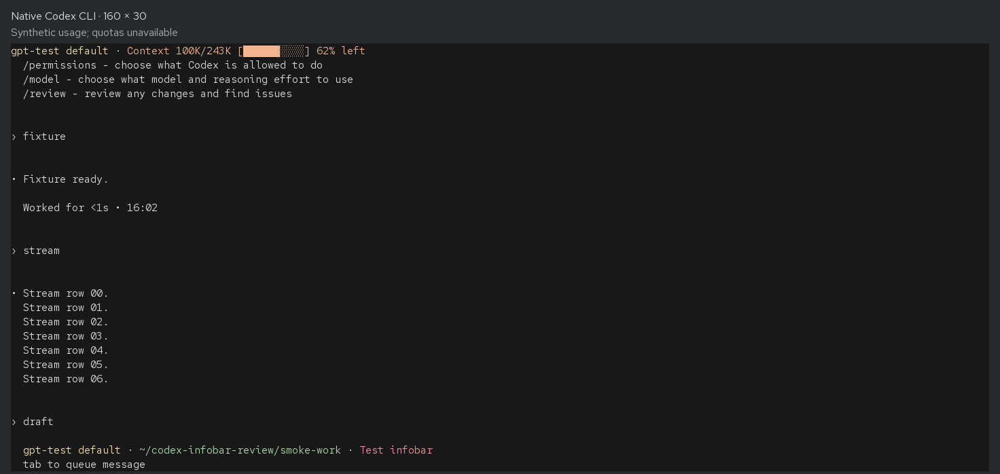

# Adaptive Codex CLI top infobar — review package

This fork contains a working native `/infobar` prototype and supporting review
material. The feature is optional and independent of the existing footer.

**Published:** [vfs90/codex, branch `feat/top-infobar`](https://github.com/vfs90/codex/tree/feat/top-infobar).
Feature request: [openai/codex#51863](https://github.com/openai/codex/issues/51863).
No pull request has been submitted.

- [Feature-request draft](FEATURE-REQUEST.md)
- [Technical report with answers 1–14](TECHNICAL-REPORT.md)
- [Exact verification commands and limitations](TESTING.md)
- [Intermediate-width smoothing results](SMOOTHING.md)
- [Feature documentation](../docs/infobar.md)
- [Native source patch](top-infobar.patch) — 31 files, +2,664/−32 lines,
  excluding this review folder
- [Native renderer](../codex-rs/tui/src/infobar.rs) and
  [metric derivation](../codex-rs/tui/src/chatwidget/infobar.rs)

Upstream base: `3e238776e857eccd3bde6bff3026e2e9798f6524` (2026-10-03).
Native feature commit: `04b8a18552fb5f93e5e88abb44a7b5f93575b320`.
Branch: `feat/top-infobar`; public fork: [vfs90/codex](https://github.com/vfs90/codex).

## Demonstrations

### Verified synthetic resize replay



This 20-second replay uses actual native terminal captures from a slow local
Responses fixture. Context is measured; unsigned account quotas and resets are
absent. Frame playback timing is illustrative. The fixture displays
`100K/243K` and `62% left` because native fallback model metadata exposes 95%
of the configured 256K window. The repository's existing percentage calculation
also retains its reserved baseline.

### User-provided visual examples

[Resize recording preview](codexTUI-preview.gif) preserves the 16.44-second
recording duration, at 900×552 and with sampled frames for a smaller download.
The original `codexTUI.gif` is preserved locally, excluded from Git because it
is approximately 99 MiB. The preview is not a frame-timing benchmark. Account
values and the host environment in these captures were not independently
verified by the automated checks.

| Appearance                | Capture                    |
| ------------------------- | -------------------------- |
| Large meters              | [large.png](large.png)     |
| Compact meters on one row | [compact.png](compact.png) |
| Wrapped text              | [wrapped.png](wrapped.png) |

`compact.png` still contains short meters; it is not the text-only variant.
The user captures show a new thread with `Context unknown`, before a token
usage measurement. Measured context and streaming/prompt behavior appear in
[synthetic full](infobar-full.png), [text-only compact](infobar-compact.png), and
[wrapped](infobar-wrapped.png) captures. No original screenshot was modified.

## Validation

The latest selected TUI suite passes **462 tests**, plus an earlier 164-test
shared usage/headline selection (partly overlapping) and one config test.
Clippy, native CLI build, Rust/Markdown formatting, patch checks, and both color
and `NO_COLOR` native PTY runs pass. Each PTY run exercises **25 settled size
changes and 42 rapid resizes**, retaining a draft and adding no model requests.
[Verification logs](verification-logs) contain final results.

These checks exercise Linux x86_64. The complete workspace suite, live account
comparison, other operating systems, screen readers, and performance benchmarks
are not claimed as verified.

## Reproduce locally

Build and run the native feature from the repository root:

```bash
cd codex-rs
export RUST_MIN_STACK=8388608
cargo test -p codex-tui --lib -- infobar settings_picker rate_limits status_surface status_line terminal_title owned_transcript slash_command local_settings rendering
cargo build -p codex-cli --bin codex
cd ..
./codexTUI/run-local.sh
```

The launcher uses a separate `codexTUI/test-home`, retains existing settings,
and accepts normal CLI arguments. Its initial selection uses the five default
infobar fields. Live account metrics require signing in normally.

Optional loopback streaming/resize reproduction, with no live account usage:

```bash
python3 -m venv codexTUI/.venv
codexTUI/.venv/bin/pip install pyte==0.8.2 wcwidth==0.9.2
codexTUI/.venv/bin/python codexTUI/tools/smoke_terminal.py
codexTUI/.venv/bin/python codexTUI/tools/smoke_terminal.py --no-color
```

The optional capture renderer additionally uses Pillow 12.3.0 and Red Hat fonts
available in the original Linux validation environment. These review tools do
not participate in the native feature and add no Codex runtime dependency.
Repository source is Apache-2.0; optional development dependencies and their
licenses are documented in the technical report.

The [current upstream contribution policy](https://github.com/openai/codex/blob/main/docs/contributing.md)
welcomes feature requests and analysis through issues and excludes external code
PRs. This package provides an implementation reference for
[feature request #51863](https://github.com/openai/codex/issues/51863), submitted
on 2026-10-07. No PR has been submitted by this workflow.

The portable launcher and loopback harness were also rerun from this review
folder: both color and `NO_COLOR` runs passed 25 settled changes and 42 rapid
resizes. See `verification-logs/package-smoke-*.log`. The verifier uses the parsed
terminal grid for streaming text, so cursor-positioned updates can reuse spaces.
